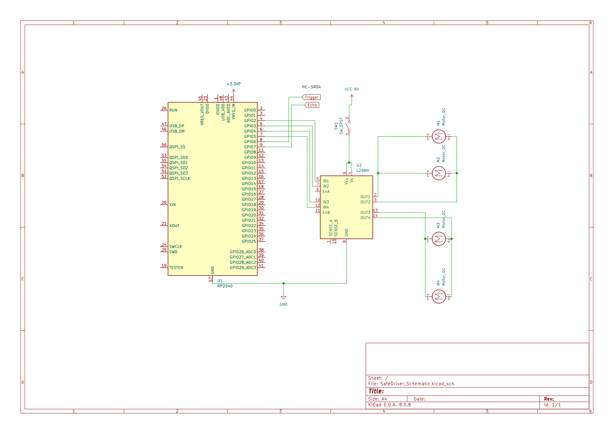

# 🚗 SafeDriverRTOS - Carro Autônomo com FreeRTOS

SafeDriverRTOS é um projeto de um carro autônomo utilizando **Raspberry Pi Pico** e **FreeRTOS**. O veículo se movimenta de forma autônoma, utilizando um **sensor ultrassônico** para detectar obstáculos e ajustar sua rota. Os motores são controlados por uma **ponte H**, garantindo uma resposta eficiente às leituras do sensor.

---

## 🎯 **Características**
- ✅ **Plataforma:** Raspberry Pi Pico
- ✅ **RTOS:** FreeRTOS para gerenciamento de tarefas em tempo real
- ✅ **Sensoriamento:** Sensor ultrassônico para evitar obstáculos
- ✅ **Movimentação:** 4 motores (2 ligados em série), controlados por uma ponte H
- ✅ **Estrutura modular:** Código organizado para facilitar manutenção e expansão

---

## 📸 **Resultado**

    
    

## 🛠 **Componentes Utilizados**
### 🔹 Hardware
- Raspberry Pi Pico
- Sensor Ultrassônico HC-SR04
- Ponte H (para controle dos motores)
- 4 motores (2 pares ligados em série)
- Fonte de alimentação compatível
- Estrutura do chassi e rodas

### 🔹 Software
- FreeRTOS
- Pico SDK
- Código-fonte em C

### 🔹 Esquemático do Projeto

